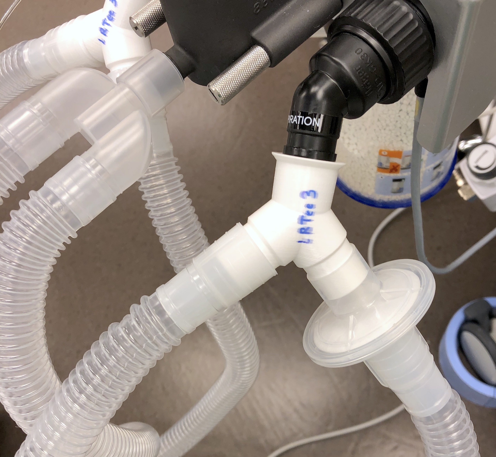
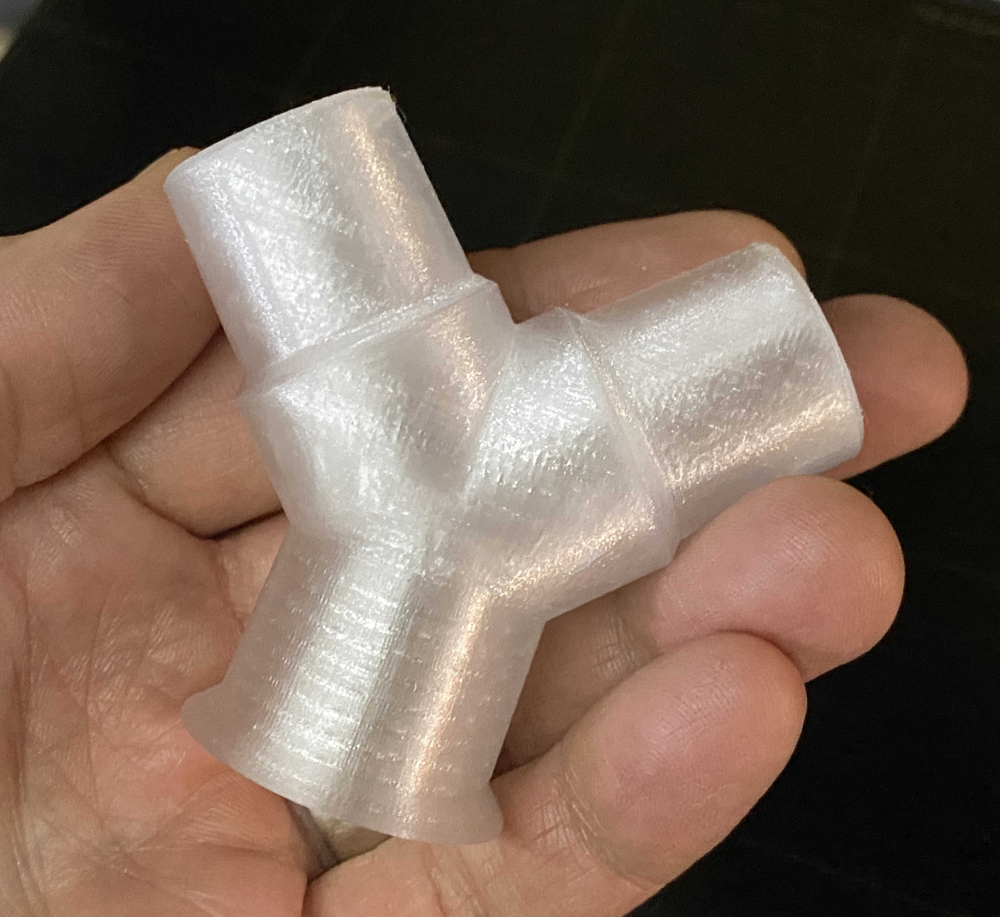
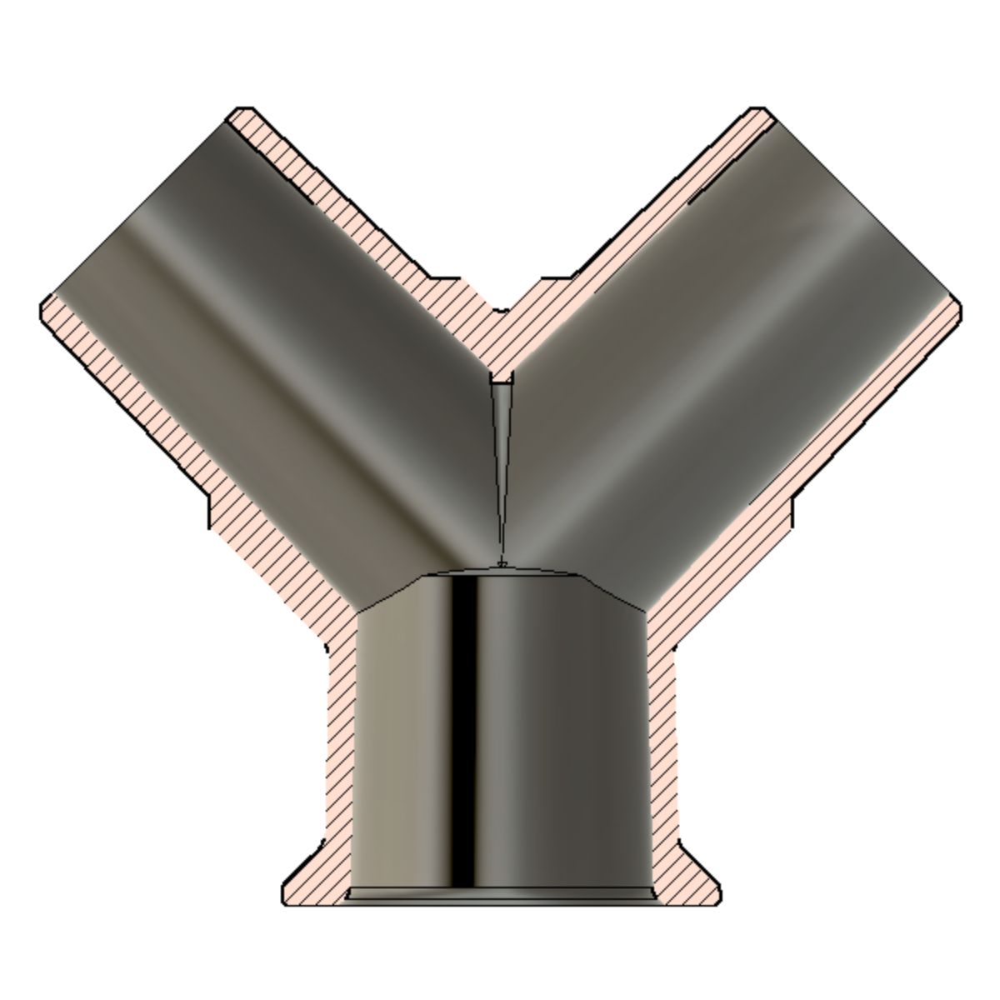

# LRTee: 3D Printed Ventilator Splitter

**LRTee is a 3D printed ventilator splitter** with standard 22mm tubing connectors to be used only in the event of Emergency Use Authorization when there is no more ventilator capacity.

Unlike other splitters, LRTee is designed to print on a standard FFF/FDM 3D printer without the need for supports/rafts and is optimized for creating an air-tight part that can pass a ventilator system's automated leak test without the need for post processing.

LRTee is released as public domain (Creative Commons Zero v1.0 Universal) for anyone to use, modify, share, produce, etc. with no strings attached.

## Background

Patients with COVID-19 in serious or critical condition often require assisted breathing via ventilator. As the number of patients in need of ventilators grows (exponentially in many densely populated regions), there are not adequate numbers of ventilators to support the high number of patients.

This is an EXPERIMENTAL splitter for 22m tubing to allow two patients to share a single ventilator. After printing/testing multiple versions of other splitter designs (see below) we decided to build a new splitter that:

* Has uniformly thicker walls.
* Has shorter branches (less likely to break).
* Is much faster to print (under 4 hours to print a usable pair or LRTee parts).
* Doesn't require supports or rafts.
* Can be scaled to handle basic low-temp sterilization (use 101-102% for PLA).
* **Released as Public Domain** (CC0) with all design files for further modifications.

## Disclaimer

As with other similar efforts, **THIS IS UNCERTIFIED, HIGHLY EXPERIMENTAL, and UNTESTED ON HUMANS**. As such, any potential use scenario would also require **legal waivers to use uncertified/untested non-medical devices** and **significant additional patient monitoring by medical professionals and certified diagnostic equipment** to reduce the risk of serious consequences in the event that the device fails to operate as intended by doctors. Use at your own risk. We take no responsibility for the safety of this device/design. 

These parts have been test-fit on anesthesia machines with ventilator capabilities and standard 22mm ventilator tubing/circuit connectors. The parts should be able to pass the system's automated "leak test" directly off the printer with no post-processing.

## Supplying LRTee to Hospitals

If you intend to print LRTee splitters and supply them to local hospitals, we recommend following these steps:

* First, contact the hospital by phone where you intend to supply the parts and see if they are needed/wanted as a last resort.
* Assume you are infected and act accordingly at all times (COVID-19 can be asymptomatic for some people, and protecting hospital staff is critically important). Wash hands and don't handle any more than necessary.
* Use the highest quality PETG or PLA you have. Using pure/uncolored materials is best to limit the addition of other unspecified compounds in the plastic.
* Make a test print. Depending on your printer's setup, you may need to tune settings to get the best print possible.
* Print the associated parts as specified. Note that it takes two (2) splitters for each additional patient, so it's logical to print and supply them in pairs.
* When the parts are finished, try to knock off any burrs, globs, or stringing that could interfere with their operation. You may also be able to gently fit the parts into each other and twist to get a sense for how smoothly the connectors fit.
* Place in a sealable/zip-top plastic bag.
* Print and fill out a form to help the hospital and make certain that you, as a maker trying to help, cannot be held liable (see [LRTee - Hospital Intake Printout.pdf](https://github.com/makefastworkshop/LRTee/blob/master/Docs/LRTee%20-%20Hospital%20Intake%20Printout.pdf)).
* Place signed and dated form in the bag with the parts and seal.
* Call ahead and schedule a drop off to appropriate medical personnel.

## Print Instructions

This part is designed to be printed in either PETG (recommended) or PLA. When sterilized, either of these materials are likely to be usable in last-resort circumstances.

While the parts should print very cleanly, it's good to double check that all fittings are clean and free of extraneous globs of materials to ensure the best connection possible. 

The parts should be able to pass the ventilator system's automated "leak test" directly off the printer with no post-processing needed.

Infill of 100% should be achieved by using a very high number of perimeters that force smooth, solid printing throughout the build.

### Printing in PETG

Printing in natural/clear PETG is recommended due to its slightly more flexible nature, toughness, and resistance to elevated temperatures (up to 75C without significant shrinkage/warping).

We've also found that PETG seems to print slightly less air-tight than PLA, but this can be greatly improved by over-extruding. Setting the "extrusion multiplier" to 1.2x (and using the associated STL file that compensates slightly for the increased print size) produces a much more air-tight part.

### Printing in PLA

Note that PLA is harder and will shrink more (when heated/sterilized) than PETG. As such, if printed in PLA a sterilization "bath" may be preferred instead of using a low-temp sterilization machine (which seems to still get up to 60C or more) to keep the part from shrinking beyond tolerances for an air-tight fit. If a PLA part will be sterilized (for example, with a low-temp VHP machine), printing at 101-102% is suggested so that the part is properly sized after shrinking.

See the image above for a comparison of shrinkage characteristics along critical dimensions for various annealing temperatures. 

## Prior Work / Reference

The general theory of using a splitter to ventilate multiple patients is nicely spelled out in [COVID-19 How to Use One Ventilator to Save Multiple Lives](https://www.youtube.com/watch?v=uClq978oohY) and [A Single Ventilator for Multiple Simulated Patients to Meet Disaster Surge](https://onlinelibrary.wiley.com/doi/epdf/10.1197/j.aem.2006.05.009).

Thanks to these projects for informing/sharing/catalyzing design and discussion to yield a usable, printable splitter.
* [3D Printed Circuit Splitter and Flow Restriction Devices for Multiple Patient Lung Ventilation](https://www.prusaprinters.org/prints/25808-3d-printed-circuit-splitter-and-flow-restriction-d)
* [Ventilator Circuit Splitters - reinforced & thicker walls](https://www.prusaprinters.org/prints/27803-ventilator-circuit-splitters-reinforced-thicker-wa)

## Changes

**Update April 5, 2020**: More testing with annealing (via hot water bath) to simulate sterilization temperatures was performed and added as a graph (see image). Added a small rise to the lower/female lip to soften the sharp corner, and now including a PETG printer config that seems to produce good results.

**Update April 7, 2020**: We've found that PLA seems to print a bit more air-tight than PETG, but that can be greatly improved by setting the "extrusion multiplier" to 1.2x and using the modified STL file that compensates for the slightly larger dimensions when printed.

**Update April 8, 2020**: Produced 4 pairs in PETG with 1.2x extrusion multiplier and ran through the full process (from intake of printed parts at a medical facility, thorough cleaning/decontamination/sanitization, and finally testing on ventilators to verify it passes the leak test).  Parts show no sign of deformation or failure and pass all primary initial tests.

**Update April 10, 2020**: Added concise documentation to help medical facilities replicate the intake/cleaning/testing process. See the "Supplying LRTee to Hospitals" section above.

